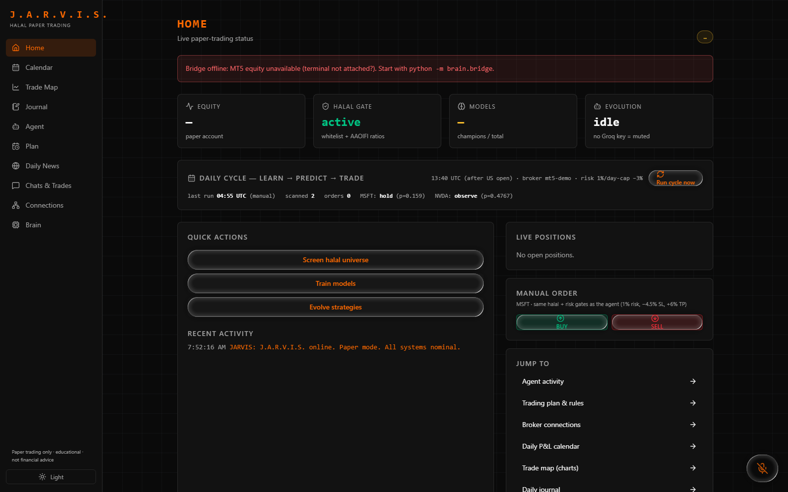
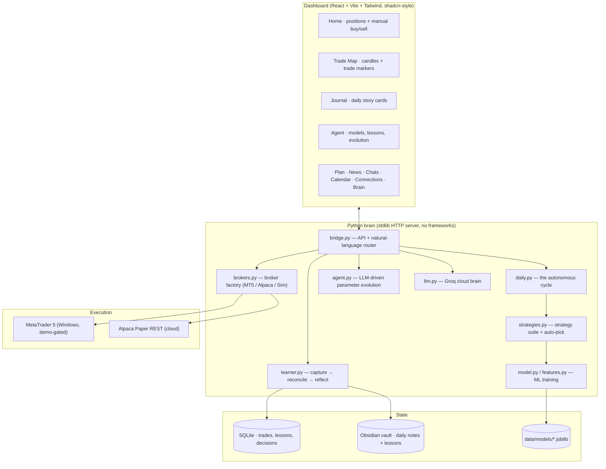

# J.A.R.V.I.S. — Self-Learning Trading Agent

> A voice-controlled, self-improving **paper-trading** system: it trains ML models on market data, proposes trades through a competition of strategies, executes them on MetaTrader 5 (demo) or Alpaca (paper), journals every decision, and learns from every outcome.

**Paper trading only · educational · not financial advice.** The system is hard-gated to demo/paper accounts — the code refuses live trading.

---

## Screenshots

| Home — positions, manual buy/sell | Agent — brain, lessons, evolution |
|---|---|
|  |  |

| Trade Map — every trade on the chart | Journal — the daily storybook |
|---|---|
|  |  |

---

## What it does

Every weekday, just after the US market open (13:40 UTC), the agent runs a full autonomous cycle:

1. **Learn** — refresh features (returns, RSI, SMA ratios, volatility, momentum) and retrain the per-symbol models, recording AUC metrics.
2. **Predict** — a suite of strategies competes: `ml_edge` (gradient-boosted ML), `ma_cross`, `rsi_reversion`, and `breakout`. The best trailing performer per symbol wins the slot.
3. **Gate** — a halal compliance screen filters the universe; risk sizing caps every position at ~1% account risk; ML entries must clear an AUC-quality threshold.
4. **Trade** — orders route to **MetaTrader 5** (local demo account) or **Alpaca Paper** (cloud). Every ML buy ships with broker-enforced **stop-loss / take-profit** brackets.
5. **Journal & learn** — every entry is captured with its probability, strategy, and reasoning; every exit (including TP/SL fills that happen while the app is closed) is reconciled from the broker and turned into a written **lesson** that feeds the next cycle's proposals.

Ask it things by voice or text: *"what's my portfolio status"*, *"train the models"*, *"what did you learn this week"*, *"buy 5 MSFT"* — freeform questions are answered by the LLM brain (Groq), actions are routed to the same safety-gated APIs.

---

## Architecture



### The learning loop

```
capture ──► reconcile ──► reflect ──► evolve
   │            │             │           │
 entry w/    broker TP/SL   written     lessons steer the LLM's
 prob, strategy, fills matched  lessons  parameter proposals (backtest
 brackets,   by position_id to Obsidian   guardrails still gate every change)
 reason      from deal history
```

A learner thread reconciles broker-side exits every 10 minutes and at every cycle, so nothing slips through even when the app is closed. Every 4th closed trade per symbol triggers a rolling review (hit-rate, cumulative P&L, verdict).

---

## Project layout

```
brain/                  the trading brain (pure Python stdlib server)
  bridge.py             HTTP API + natural-language command router
  daily.py              autonomous cycle: learn → predict → trade → journal
  strategies.py         strategy suite (ml_edge, ma_cross, rsi_reversion, breakout)
  model.py features.py  ML training + feature engineering
  learner.py            capture / reconcile / reflect pipeline
  brokers.py            broker factory: MT5Demo | AlpacaPaper | SimBroker
  mt5_bridge.py         MetaTrader5 terminal bridge (+ net-close, brackets)
  agent.py / llm.py     evolution agent + Groq LLM
  halal.py risk.py      compliance screen + position sizing
  store.py memory.py    SQLite schema + Obsidian vault notes
dashboard/              React + Vite + Tailwind frontend (10 pages)
data/models/            pre-trained model artifacts (shipped with the repo)
.github/workflows/      cloud automation (GitHub Actions)
start_jarvis.py         one-command launcher (serves dashboard + brain)
autostart_jarvis.vbs    Windows logon autostart
```

---

## Quick start (local, Windows)

```powershell
# 1. Python 3.12+ and a virtual environment
python -m venv .venv
.venv\Scripts\pip install -r requirements.txt

# 2. Frontend dependencies (only if you want to modify the UI)
cd dashboard && npm install && npm run build && cd ..

# 3. Configure
copy .env.example .env        # add GROQ_API_KEY (free at console.groq.com)

# 4. Run
.venv\Scripts\python start_jarvis.py
```

Open **http://127.0.0.1:8765** — the dashboard and the brain run in one process.

For MetaTrader execution: install the MT5 terminal, log into a **demo** account, and the app detects it on the Connections page (credentials go in `.env` as `MT5_LOGIN` / `MT5_PASSWORD` / `MT5_SERVER`). Without MT5, the built-in `SimBroker` executes everything locally — the whole system works out of the box.

### Autostart at logon

Run `autostart_jarvis.vbs` once (or copy it into your Startup folder) — the agent then boots with Windows.

---

## Cloud hosting (free, laptop off)

The repo ships a GitHub Actions workflow that runs the **same brain** every weekday at 13:40 UTC, using Alpaca Paper for execution and committing its accumulated memory to an `agent-memory` branch between runs.

One-time setup:

1. Create a free **Alpaca paper** account and generate API keys.
2. In your GitHub fork: **Settings → Secrets and variables → Actions**, add `GROQ_API_KEY`, `ALPACA_KEY_ID`, `ALPACA_SECRET_KEY`.
3. Enable Actions (or trigger **jarvis-daily** manually with *Run workflow*).

`JARVIS_BROKER=alpaca` selects the paper broker in the cloud; locally the default stays MT5.

---

## Voice / chat commands

| Say | What happens |
|---|---|
| "what's my portfolio status" | live positions, equity, day P&L |
| "train the models" | full retrain with metrics |
| "what did you learn recently" | the lesson feed |
| "buy 5 MSFT" / "sell 2 AAPL" | manual order through the same risk gates |
| "how are the connections" | MT5 / Groq / Alpaca / webhook status |
| anything else | answered by the LLM brain with live context |

---

## Safety model

- **Demo-gated by design** — `MT5Demo` refuses live accounts; Alpaca adapter is hard-coded to paper endpoints.
- **Risk sizing** — ~1% account risk per position, computed from the stop distance.
- **Quality gates** — ML entries require model AUC above threshold; halal screen filters non-compliant symbols.
- **Broker-side brackets** — stop-loss and take-profit live on the broker's servers, enforced even when the app is off.
- **Backtest guardrails** — only backtested parameter sets reach production; lessons inform proposals, they don't bypass gates.

## Tech stack

Python 3.12 · stdlib `http.server` (zero web frameworks) · scikit-learn · MetaTrader5 package · Alpaca REST · Groq API · React 19 + Vite + Tailwind CSS 4 + shadcn-style components · canvas-drawn candlestick chart (no chart dependency) · GitHub Actions.

## License

MIT — see [LICENSE](LICENSE).
